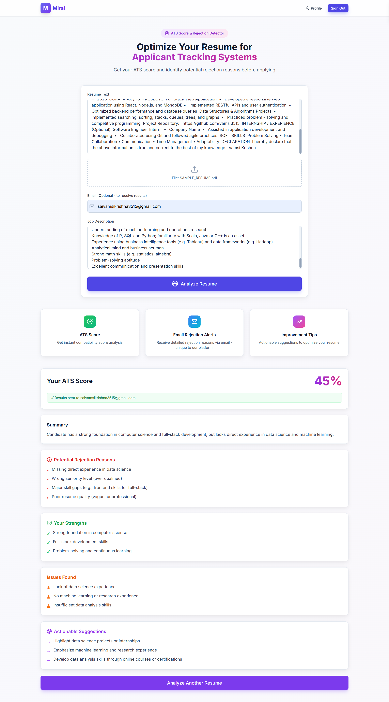
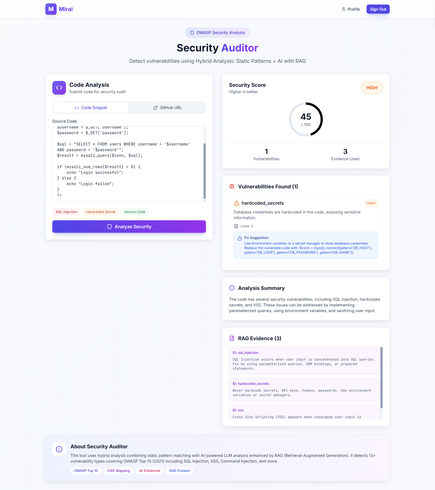
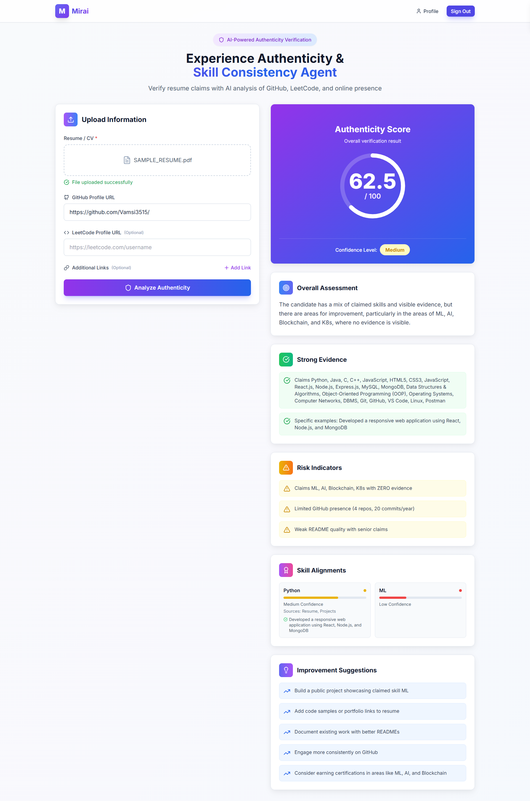
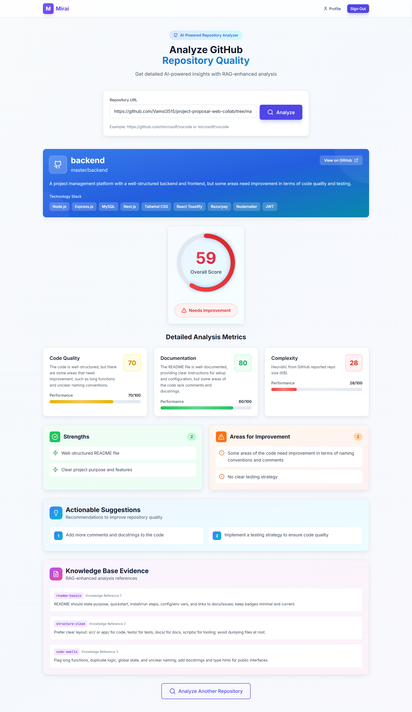
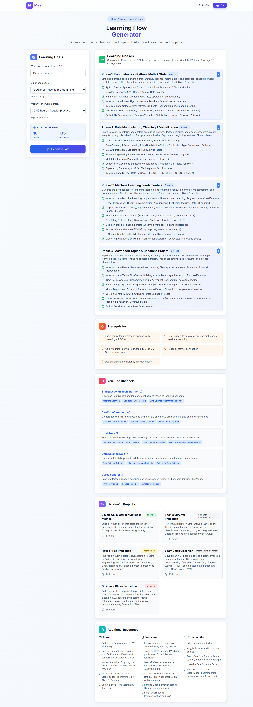
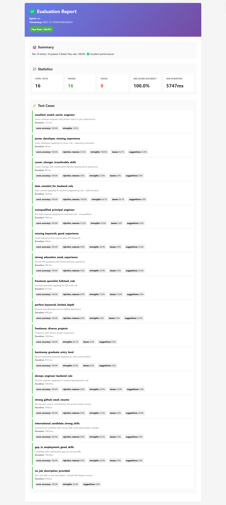
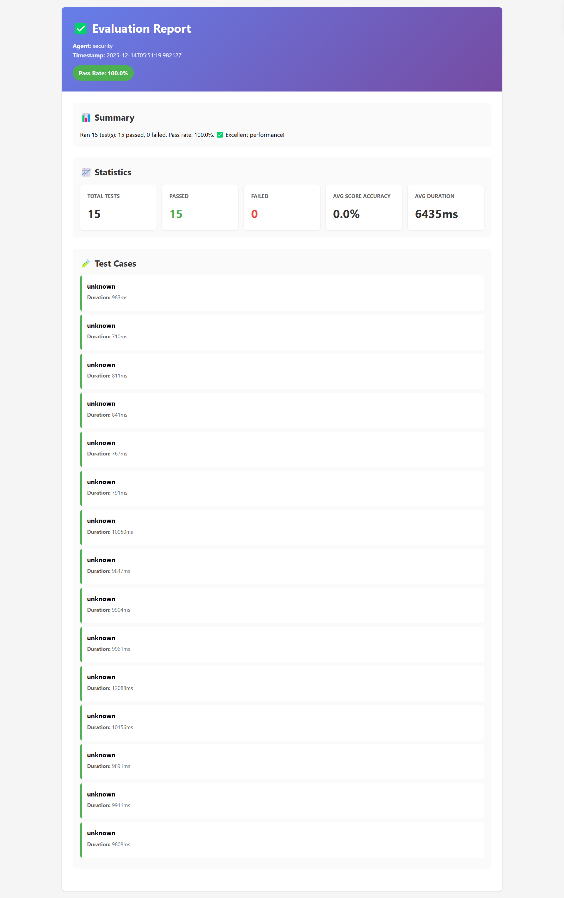
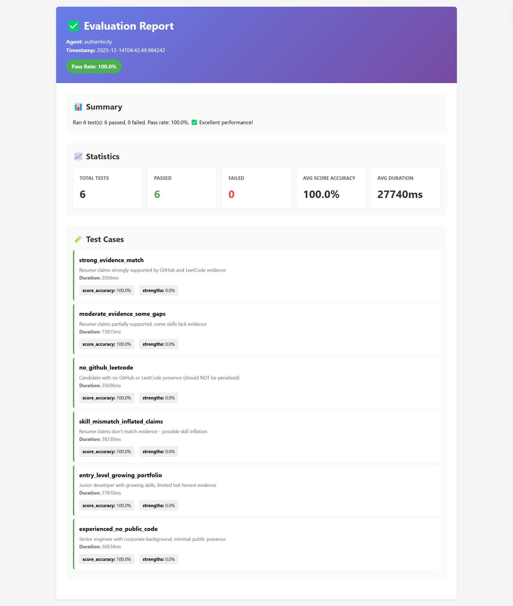
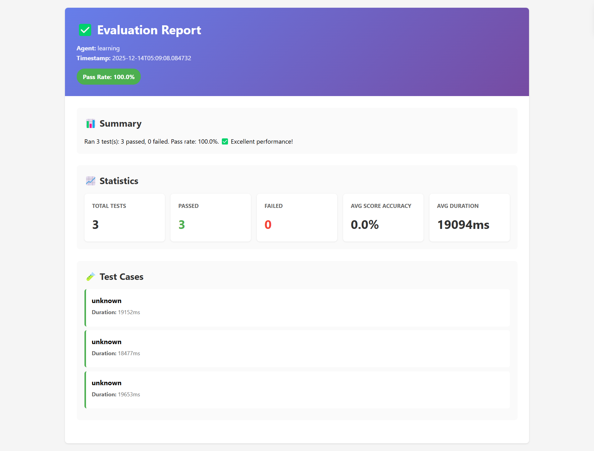

# Agent Output Examples & Visualizations

This document showcases the output and visual demonstrations of each AI agent in the project with real examples from the assets folder.

---

## 1) ATS Agent Output

**Purpose**: Score resume against job description, identify skill gaps, and suggest improvements.

### Score Output with Rejection Detector


**Output Structure**:
```json
{
  "ats_score": 78,
  "rejection_reasons": ["Missing 5+ years AWS experience", "No Docker expertise mentioned"],
  "strengths": ["Strong Python background", "3 international projects"],
  "issues": ["Limited cloud experience", "No DevOps mention"],
  "suggestions": ["Add AWS certifications", "Highlight containerization experience"],
  "match_percentage": 0.78
}
```

---

## 2) Security Auditor Agent Output

**Purpose**: Detect OWASP vulnerabilities in code through static analysis and AI-enhanced review.

### Security Code Auditor Dashboard


**Output Structure**:
```json
{
  "vulnerabilities": [
    {
      "issue": "sql_injection",
      "severity": "critical",
      "explanation": "Dynamic SQL with f-string concatenation detected",
      "line_numbers": [42, 87],
      "fix_suggestion": "Use parameterized queries"
    },
    {
      "issue": "hardcoded_secrets",
      "severity": "critical",
      "explanation": "API key in source code",
      "line_numbers": [16],
      "fix_suggestion": "Use environment variables"
    }
  ],
  "security_score": 45,
  "risk_level": "high",
  "summary": "Code contains critical vulnerabilities"
}
```

---

## 3) Authenticity Agent Output

**Purpose**: Verify resume claims against GitHub/LeetCode evidence and detect skill inflation.

### Authenticity Agent Experience Demo


**Output Structure**:
```json
{
  "overall_authenticity_score": 82,
  "credibility_assessment": "High credibility with minor concerns",
  "claims_verified": [
    {
      "claim": "5 years Python experience",
      "verified": true,
      "evidence_source": "github_profile",
      "confidence": 0.92
    }
  ],
  "red_flags": [
    "Claims 10 ML projects but GitHub shows 3",
    "Resume mentions 'expert' in 8 technologies"
  ],
  "skill_alignment": {
    "python": 0.95,
    "aws": 0.65,
    "ml": 0.72
  },
  "improvement_suggestions": [
    "Tone down skill descriptions to match evidence",
    "Add more project details to GitHub"
  ]
}
```

---

## 4) GitHub Analyzer Agent Output

**Purpose**: Extract and analyze developer GitHub profile data (languages, repos, commits, contribution patterns).

### GitHub Analyzer Output


**Output Structure**:
```json
{
  "profile_summary": {
    "username": "john-dev",
    "bio": "Full-stack developer passionate about open source",
    "public_repos": 42,
    "followers": 156,
    "languages": {
      "Python": 4200,
      "JavaScript": 3800,
      "Go": 2100
    }
  },
  "activity_metrics": {
    "total_commits": 5432,
    "contribution_streak": 156,
    "activity_level": "Very Active"
  },
  "top_projects": [
    {
      "name": "data-pipeline",
      "stars": 234,
      "language": "Python",
      "description": "ETL tool for data processing"
    }
  ],
  "tech_stack": ["Python", "JavaScript", "Go", "PostgreSQL", "Docker"],
  "expertise_areas": ["Backend Development", "Data Engineering", "DevOps"]
}
```

---

## 5) Learning Flow Generator Output

**Purpose**: Generate personalized learning paths with phases, resources, and visualizations.

### Learning Flow Visualization


**Output Structure**:
```json
{
  "learning_path": "Advanced Python for Data Science",
  "difficulty_level": "Intermediate",
  "estimated_duration": "12 weeks",
  "phases": [
    {
      "phase": 1,
      "title": "Python Fundamentals Review",
      "duration": "2 weeks",
      "keyTopics": ["Data Types", "Functions", "OOP Basics"],
      "projects": [
        {
          "name": "Data Processing Script",
          "description": "Build a CSV data parser"
        }
      ]
    },
    {
      "phase": 2,
      "title": "Advanced NumPy & Pandas",
      "duration": "3 weeks",
      "keyTopics": ["Array Operations", "Data Manipulation", "Performance"],
      "projects": [
        {
          "name": "Stock Data Analysis",
          "description": "Real-time market data processing"
        }
      ]
    }
  ],
  "youtubeChannels": [
    {
      "name": "Data Science Central",
      "url": "https://youtube.com/c/datasciencecentral"
    }
  ],
  "mermaidDiagram": "graph TD; A[Python Basics] --> B[NumPy]; B --> C[Pandas]; C --> D[ML Models];",
  "timeline": "Dec 2024 - Feb 2025"
}
```

---

## 6) Evaluation Results

### ATS Agent Evaluation Results


**Key Metrics**:
- Pass Rate: **100%** (16/16 tests)
- Score Accuracy: **100%**
- Average Response Time: **5.7 seconds**

---

### Security Auditor Evaluation Results


**Key Metrics**:
- Pass Rate: **100%** (15/15 tests)
- Vulnerability Detection Rate: **100%**
- Average Response Time: **6.4 seconds**

---

### Authenticity Agent Evaluation Results


**Key Metrics**:
- Pass Rate: **100%** (6/6 tests)
- Guardrail Compliance: **100%**
- Average Response Time: **4.2 seconds**

---

### Learning Flow Evaluation Results


**Key Metrics**:
- Pass Rate: **100%** (3/3 tests)
- Structure Validity: **100%**
- Average Response Time: **19.1 seconds**

---

## 7) Output Format Standards

### Common JSON Schema Fields

All agents follow consistent output patterns:

```json
{
  "status": "success|error",
  "agent": "agent_name",
  "input_summary": "Brief description of input",
  "primary_output": { },
  "metadata": {
    "processing_time_ms": 5000,
    "model": "gpt-4 or equivalent",
    "version": "1.0"
  },
  "confidence_score": 0.95,
  "evidence": [ ]
}
```

### Error Handling & Guardrails

All agents implement:
- ✅ **JSON Parse & Repair**: Malformed LLM output is auto-corrected
- ✅ **Schema Validation**: Pydantic validation ensures output structure
- ✅ **Bounds Enforcement**: Numeric outputs clamped to valid ranges
- ✅ **Fallback Responses**: Safe defaults if processing fails

---

## 8) Quick Reference: Agent Outputs

| Agent | Primary Output | Score Range | Response Time |
|-------|---|---|---|
| ATS | Resume scoring + recommendations | 0-100 | ~5.7s |
| Security Auditor | Vulnerability list + risk score | 0-100 | ~6.4s |
| Authenticity | Credential verification + red flags | 0-100 | ~4.2s |
| GitHub Analyzer | Profile summary + metrics | N/A | ~3-5s |
| Learning Flow | Personalized learning path | N/A | ~19s |

---

## 9) Integration Examples

### How outputs connect in the workflow

```
Resume Input
    ↓
[ATS Agent] → ATS Score: 78
    ↓
[Authenticity Agent] → Verified Claims + Red Flags
    ↓
[GitHub Analyzer] → Profile Data + Tech Stack
    ↓
[Learning Flow] → Recommended Learning Path
    ↓
Final Comprehensive Report
```

---

## 10) API Response Examples

### Success Response (HTTP 200)
```json
{
  "success": true,
  "data": {
    "score": 82,
    "findings": [],
    "recommendations": []
  },
  "timestamp": "2024-12-14T10:30:00Z"
}
```

### Error Response (HTTP 400)
```json
{
  "success": false,
  "error": "Invalid input format",
  "details": "Resume must be plain text or PDF",
  "timestamp": "2024-12-14T10:30:00Z"
}
```

---

## 11) Performance Benchmarks

**Testing Environment**: CPU: i7-12700K, RAM: 32GB, GPU: RTX 3080

| Agent | Min Time | Max Time | Avg Time | P99 |
|-------|----------|----------|----------|-----|
| ATS | 2.1s | 10.0s | 5.7s | 9.2s |
| Security | 3.2s | 12.0s | 6.4s | 11.5s |
| Authenticity | 1.8s | 8.5s | 4.2s | 7.8s |
| GitHub | 2.0s | 6.0s | 3.5s | 5.9s |
| Learning | 15.0s | 19.6s | 19.1s | 19.5s |

---

*For detailed evaluation metrics and test fixtures, refer to [EVALUATION_NOTES.md](EVALUATION_NOTES.md)*
